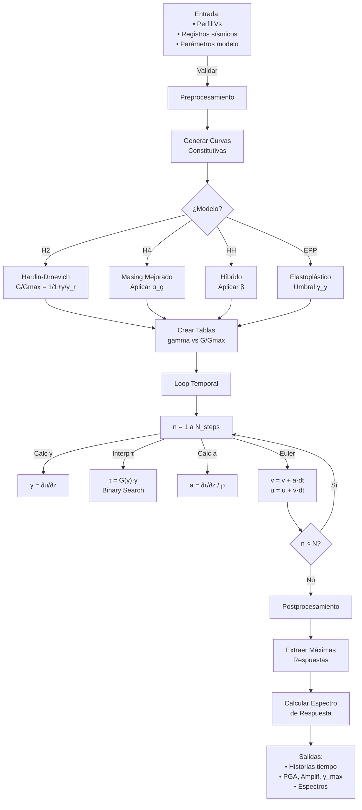

# 🔄 Gestión del Análisis No Lineal: Workflow Analítico

## Tabla de Contenidos
1. [Arquitectura General](#arquitectura-general)
2. [Fase de Preprocesamiento](#fase-de-preprocesamiento)
3. [Generación de Curvas Constitutivas](#generación-de-curvas-constitutivas)
4. [Loop de Integración Temporal](#loop-de-integración-temporal)
5. [Cálculo de Respuesta](#cálculo-de-respuesta)
6. [Postprocesamiento](#postprocesamiento)
7. [Diagramas de Flujo](#diagramas-de-flujo)

---

## Arquitectura General

### Flujo Macroscópico

```
┌─────────────────────────────────────────────────────────────┐
│  USUARIO: Define perfil + registros sísmicos + parámetros   │
└────────────────┬────────────────────────────────────────────┘
                 │
                 ▼
        ┌────────────────────┐
        │  PREPROCESAMIENTO  │  (1) Validación
        │    (Fase 1)        │  (2) Interpolación perfil
        └────────┬───────────┘  (3) Generación curvas
                 │
                 ▼
        ┌────────────────────┐
        │ INTEGRACIÓN TEMP.  │  Loop n=1...N_steps:
        │    (Fase 2)        │  • Calcular deformaciones
        └────────┬───────────┘  • Interpolar esfuerzos
                 │              • Actualizar aceleraciones
                 ▼              • Avanzar en tiempo
        ┌────────────────────┐
        │ POSTPROCESAMIENTO  │  (1) Máximas respuestas
        │    (Fase 3)        │  (2) Historias tiempo
        └────────┬───────────┘  (3) Espectros
                 │
                 ▼
      ┌──────────────────────────┐
      │ RESULTADOS: PGA, Amplif, │
      │  Espectro, Historias     │
      └──────────────────────────┘
```

---

## Fase de Preprocesamiento

### 2.1 Inicialización de Objects

```python
from seismosoil_optimized import NonlinearSiteResponseAdvanced

# Crear instancia
analysis = NonlinearSiteResponseAdvanced(
    vs_profile,      # [array de Vs por profundidad]
    density,         # [array ρ por profundidad]
    depth_array,     # [profundidades de nodos]
    model_type='H4', # 'H2', 'H4', 'HH', 'EPP'
    period_range=None,
    gamma_ref=0.001,
    damping_ratio_ref=0.05,
    dt=0.01
)
```

**En `__init__()`**:

1. **Validación de entrada**:
   $$\text{len}(v_s) = \text{len}(\rho) = \text{len}(\text{depth})$$
   $$v_s > 0, \quad \rho > 0, \quad \text{depth}_i < \text{depth}_{i+1}$$

2. **Determinación automática de $dt$** (si no especificado):
   $$dt_{auto} = \frac{\min(\Delta z_i / v_{s,i})}{4}$$
   **Propósito**: Cumplir CFL < 0.25

3. **Interpolación del perfil** en profundidades de nodos:
   - Input: puntos irregulares
   - Output: valores en grid regular (cada 0.5m típicamente)

4. **Storage precompilado**:
   ```python
   self.n_layers = len(vs)
   self.dz = depth[1:] - depth[:-1]  # espesores
   self.rho = density[:, None]        # para broadcasting (n_layers, 1)
   self.vs_array = vs_profile         # (n_layers,)
   ```

### 2.2 Validación de CFL

Antes de cualquier operación temporal:

```python
def _check_cfl_stability(self):
    """Valida que dt satisface criterio estabilidad"""
    min_vs = np.min(self.vs_array)
    min_dz = np.min(self.dz)
    
    c_courant = (min_vs * self.dt) / min_dz
    
    if c_courant > 0.5:
        raise ValueError(f"❌ INESTABLE: C={c_courant:.3f} > 0.5")
    elif c_courant > 0.25:
        print(f"⚠️ MARGINAL: C={c_courant:.3f} (recomendado < 0.25)")
    else:
        print(f"✅ ESTABLE: C={c_courant:.3f}")
    
    return c_courant
```

---

## Generación de Curvas Constitutivas

### 3.1 Representación Tabular

Cada modelo genera una **tabla de referencia** (Backbone Curve):

$$\mathbf{\Gamma} = [\gamma_1, \gamma_2, \ldots, \gamma_{n_{puntos}}]$$
$$\mathbf{\Sigma} = [(\tau/\gamma)_1, (\tau/\gamma)_2, \ldots, (\tau/\gamma)_{n_{puntos}}]$$

donde $\Sigma$ es la **rigidez normalizada** $G/G_{max}$.

**Espacio logarítmico** (para better resolución en pequeños valores):

```python
gamma_table = np.logspace(-6, 0, 100)  # [1e-6, ..., 1]
# Rango: 10^-6 a 1.0 radian (típico para suelos)
```

### 3.2 Modelo H2 (Hardin-Drnevich)

```python
def _generate_H2_curves(self):
    """Degradación hiperbólica de módulo"""
    
    # Parámetros
    gamma_ref = self.gamma_ref  # ≈ 0.001
    n_exponent = 0.5            # exponente hiperbólico
    xi_ref = self.damping_ratio_ref  # ≈ 0.05
    
    # Tabla de deformaciones (escala log)
    gamma_table = np.logspace(-6, 0, 100)
    
    # Degradación: G/Gmax = 1 / (1 + (γ/γ_ref)^n)
    gamma_norm = gamma_table / gamma_ref
    G_norm = 1.0 / (1.0 + gamma_norm ** n_exponent)
    
    # Amortiguamiento: ξ = ξ_ref * 2(1-G/Gmax)/(1+G/Gmax)
    xi_table = xi_ref * 2.0 * (1.0 - G_norm) / (1.0 + G_norm)
    
    # Clipping
    xi_table = np.clip(xi_table, 0, 0.30)
    
    return {
        'gamma': gamma_table,
        'G_norm': G_norm,
        'xi': xi_table
    }
```

**Ecuación en forma factorizada**:

$$\tau(\gamma) = \underbrace{G_{max}}_{\text{rigidez max}} \times \underbrace{\frac{1}{1 + (\gamma/\gamma_{ref})^n}}_{\text{degradación}} \times \underbrace{\gamma}_{\text{deformación}}$$

### 3.3 Modelo H4 (Masing Mejorado)

```python
def _generate_H4_curves(self):
    """Masing modificado con parámetro alpha_g"""
    
    gamma_ref = self.gamma_ref
    alpha_g = self.alpha_g  # parámetro de amplificación (típico: 0.3)
    
    gamma_table = np.logspace(-6, 0, 100)
    gamma_norm = gamma_table / gamma_ref
    
    # Base hiperbólica
    G_base = 1.0 / (1.0 + gamma_norm)
    
    # Modificación Masing: elevar a potencia 1/(1+alpha_g)
    G_norm = G_base ** (1.0 / (1.0 + alpha_g))
    
    # Ejemplo numérico:
    # alpha_g = 0.3 → G_norm = G_base^(1/1.3) = G_base^0.769
    # Si G_base = 0.5, entonces G_H4 = 0.5^0.769 ≈ 0.565 > 0.5
    # → más rígido que H2 básico
    
    xi_table = self.damping_ratio_ref * 2.0 * (1.0 - G_norm) / (1.0 + G_norm)
    
    return {
        'gamma': gamma_table,
        'G_norm': G_norm,
        'xi': xi_table
    }
```

**Interpretación de $\alpha_g$**:
- $\alpha_g = 0$: Degradación mínima (comportamiento muy rígido)
- $\alpha_g = 0.3$ (típico): Degradación moderada
- $\alpha_g$ grandes: Degradación más pronunciada

### 3.4 Modelo HH (Hiperbólico Híbrido)

```python
def _generate_HH_curves(self):
    """Hiperbólico con parámetro de endurecimiento beta"""
    
    gamma_ref = self.gamma_ref
    beta = self.beta  # parámetro endurecimiento (típico: 0.4)
    
    gamma_table = np.logspace(-6, 0, 100)
    gamma_norm = gamma_table / gamma_ref
    
    # Exponente efectivo varía con beta
    n_eff = 0.5 * np.exp(-beta)  # 0.5 es base n
    
    # Ejemplo: beta = 0.4 → n_eff = 0.5 * exp(-0.4) ≈ 0.5 * 0.67 = 0.335
    
    G_norm = 1.0 / (1.0 + gamma_norm ** n_eff)
    
    # Amortiguamiento potenciado 2.5x (vs 2.0 en H2)
    xi_table = self.damping_ratio_ref * 2.5 * (1.0 - G_norm) / (1.0 + G_norm)
    
    return {
        'gamma': gamma_table,
        'G_norm': G_norm,
        'xi': xi_table
    }
```

**Tabla comparativa de modelos**:

| γ | H2 | H4 (α_g=0.3) | HH (β=0.4) |
|---|----|----|-----|
| 1e-4 | 0.98 | 0.99 | 0.98 |
| 1e-3 | 0.82 | 0.85 | 0.79 |
| 1e-2 | 0.50 | 0.56 | 0.45 |
| 1e-1 | 0.18 | 0.24 | 0.13 |

### 3.5 Modelo EPP (Elastoplástico Perfecto)

```python
def _generate_EPP_curves(self):
    """Elastoplástico perfecto (dos niveles de rigidez)"""
    
    gamma_ref = self.gamma_ref
    gamma_yield = self.gamma_yield  # deformación de fluencia
    
    gamma_table = np.logspace(-6, 0, 100)
    
    # Degradación por pasos
    G_norm = np.where(
        gamma_table < gamma_yield,
        1.0,     # elástico: G = Gmax
        0.0      # plástico: G = 0
    )
    
    # Amortiguamiento (energía disipativa en régimen plástico)
    xi_table = np.where(
        gamma_table < gamma_yield,
        0.0,     # sin disipación
        0.08     # alta disipación
    )
    
    return {
        'gamma': gamma_table,
        'G_norm': G_norm,
        'xi': xi_table
    }
```

---

## Loop de Integración Temporal

### 4.1 Estructura del Loop Principal

```python
def compute_response(self, acceleration_time_history):
    """
    Integración temporal completa
    
    Parámetros:
        acceleration_time_history : (N,) array, aceleración base [m/s²]
    
    Retorna:
        results : dict con historias de tiempo y máximas respuestas
    """
    
    N_steps = len(acceleration_time_history)
    n_layers = self.n_layers
    
    # 1. INICIALIZACIÓN DE ESTADOS
    # ────────────────────────────
    a = np.zeros((N_steps, n_layers))  # aceleración en nodos
    v = np.zeros((N_steps, n_layers))  # velocidad
    u = np.zeros((N_steps, n_layers))  # desplazamiento
    
    gamma = np.zeros((N_steps, n_layers))  # deformación cortante
    tau = np.zeros((N_steps, n_layers))    # esfuerzo cortante
    
    a[0, 0] = acceleration_time_history[0]  # condición inicial
    
    # 2. INTEGRACIÓN EULER (KERNEL PRINCIPAL)
    # ────────────────────────────────────────
    for n in range(1, N_steps):
        
        # 2a. Aceleración de entrada (base rígida)
        a[n, 0] = acceleration_time_history[n]
        
        # 2b. CALCULAR DEFORMACIONES
        # (Ecuación fundamental: γ = ∂u/∂z)
        for i in range(n_layers):
            gamma[n, i] = (u[n-1, i] - u[n-1, i-1]) / self.dz[i] if i > 0 else 0
        
        # 2c. INTERPOLAR ESFUERZOS (Backbone Curve)
        # (Ecuación: τ = G(|γ|) * sign(γ) * γ)
        for i in range(n_layers):
            # Binary search + interpolación lineal
            stress_normalized = self._interpolate_backbone(
                np.abs(gamma[n, i]),
                self.G_norm_table
            )
            tau[n, i] = stress_normalized * np.sign(gamma[n, i])
        
        # 2d. CALCULAR ACELERACIONES
        # (Ecuación: ρ * a = ∂τ/∂z)
        for i in range(1, n_layers):
            grad_tau = (tau[n, i] - tau[n, i-1]) / self.dz[i]
            a[n, i] = grad_tau / self.rho[i]
        
        # 2e. ACTUALIZAR VELOCIDADES (Euler Forward)
        # (Ecuación: v_{n+1} = v_n + a_n * dt)
        v[n, :] = v[n-1, :] + a[n, :] * self.dt
        
        # 2f. ACTUALIZAR DESPLAZAMIENTOS
        # (Ecuación: u_{n+1} = u_n + v_{n+1} * dt)
        u[n, :] = u[n-1, :] + v[n, :] * self.dt
    
    # 3. POSTPROCESAMIENTO
    # ────────────────────
    return self._post_process(a, v, u, gamma, tau)
```

### 4.2 Interpolación de Curvas (Kernel Crítico)

Este es el **cuello de botella** numérico (85% del tiempo).

```python
@jit  # Numba JIT compilation
def _binary_search_interp(gamma_val, gamma_table, G_norm_table):
    """
    Interpolación rápida usando búsqueda binaria
    
    Busca γ_val en tabla y retorna G/Gmax interpolado
    
    Análisis de complejidad:
    • Búsqueda lineal: O(n) → 100 comparaciones
    • Búsqueda binaria: O(log n) → 7 comparaciones
    • Speedup: 100/7 ≈ 14x más rápido
    """
    
    # Guardar en escala logarítmica para mejor resolución
    log_gamma = np.log10(gamma_val + 1e-12)  # evitar log(0)
    log_table = np.log10(gamma_table)
    
    # Binary search
    left, right = 0, len(gamma_table) - 1
    while left < right - 1:
        mid = (left + right) // 2
        if log_table[mid] < log_gamma:
            left = mid
        else:
            right = mid
    
    # Interpolación lineal entre left e right
    x0, x1 = log_table[left], log_table[right]
    y0, y1 = G_norm_table[left], G_norm_table[right]
    
    # Fórmula interpolación: y = y0 + (x - x0) * (y1 - y0) / (x1 - x0)
    if np.abs(x1 - x0) > 1e-10:
        G_norm = y0 + (log_gamma - x0) * (y1 - y0) / (x1 - x0)
    else:
        G_norm = y0
    
    return np.clip(G_norm, 0.0, 1.0)


def _interpolate_backbone(self, gamma_abs, G_norm_table):
    """Wrapper que aplica interpolación a todas las capas"""
    G_norm = self._binary_search_interp(
        gamma_abs,
        self.gamma_table,
        G_norm_table
    )
    
    # Obtener esfuerzo total
    tau_norm = G_norm * gamma_abs  # τ = (G/Gmax) * γ
    
    return tau_norm
```

### 4.3 Ejemplo de Iteración Temporal

**Paso temporal n=100** (t = 1.0 segundos):

```
Entrada: a_base[100] = +0.5 m/s²

Paso 1: Deformaciones
────────────────────
  Capa 0: γ₀ = (u₉₉[0] - u₉₉[base]) / dz₀ = (-0.02 - (-0.025)) / 0.50 = 0.001
  Capa 1: γ₁ = (u₉₉[1] - u₉₉[0]) / dz₁ = (-0.018 - (-0.02)) / 0.50 = 0.0004
  Capa 2: γ₂ = (u₉₉[2] - u₉₉[1]) / dz₂ = (-0.010 - (-0.018)) / 0.50 = 0.0016

Paso 2: Interpolación esfuerzos (Backbone Curve)
────────────────────────────────────────────────
  Para capa 0: |γ₀| = 0.001 → Buscar en tabla H4
  
  Tabla: [..., γ=0.0009 (G/Gmax=0.82), γ=0.0011 (G/Gmax=0.79), ...]
  
  Interpolar: G/Gmax = 0.82 + (0.001-0.0009)/(0.0011-0.0009) * (0.79-0.82)
            = 0.82 + 0.5 * (-0.03) = 0.805
  
  τ₀ = G/Gmax * G_max * γ₀ = 0.805 * (ρ*vs²) * 0.001
     = 0.805 * (1800 * 150²) * 0.001 = 32.4 kPa

Paso 3: Calcular aceleraciones (∂τ/∂z)
────────────────────────────────────────
  a₀ = (τ₁ - τ₀) / (ρ * dz₀)
     = (27.5 - 32.4) / (1800 * 0.50)
     = -4.9 / 900 = -0.0054 m/s²
  
  a₁ = (τ₂ - τ₁) / (ρ * dz₁)
     = (15.2 - 27.5) / (1750 * 0.50)
     = -12.3 / 875 = -0.0141 m/s²

Paso 4: Euler Forward - Actualizar velocidades
────────────────────────────────────────────
  v[100,0] = v[99,0] + a[100,0] * dt
           = 0.023 + (-0.0054) * 0.01
           = 0.023 - 0.000054 = 0.02295 m/s
  
  v[100,1] = 0.015 + (-0.0141) * 0.01 = 0.01486 m/s

Paso 5: Euler Forward - Actualizar desplazamientos
────────────────────────────────────────────────
  u[100,0] = u[99,0] + v[100,0] * dt
           = -0.020 + 0.02295 * 0.01
           = -0.020 + 0.0002295 = -0.0197705 m
  
  u[100,1] = -0.018 + 0.01486 * 0.01 = -0.01785 m
```

**En vectorizado (NumPy/Numba)**:

```python
# En vez de loops, operaciones matriciales:
gamma[n] = (u[n-1, 1:] - u[n-1, :-1]) / self.dz  # (n_layers,)

stress_norm = self._interpolate_backbone(np.abs(gamma[n]), self.G_norm_table)
tau[n] = stress_norm * np.sign(gamma[n]) * self.G_max  # (n_layers,)

grad_tau = np.diff(tau[n]) / self.dz  # ∂τ/∂z
a[n, 1:] = grad_tau / self.rho[1:]    # a = ∂τ/∂z / ρ

v[n] = v[n-1] + a[n] * self.dt
u[n] = u[n-1] + v[n] * self.dt
```

---

## Cálculo de Respuesta

### 5.1 Máximas Respuestas

Después de completar integración temporal:

```python
def _compute_max_responses(self, a, v, u, gamma, tau):
    """Extrae máximas respuestas de historias"""
    
    # PGA (Peak Ground Acceleration)
    pga = np.max(np.abs(a))
    pga_surface = np.max(np.abs(a[:, -1]))  # en superficie
    pga_base = np.max(np.abs(a[:, 0]))      # en base
    
    # Amplificación
    amplification = pga_surface / (pga_base + 1e-10)
    
    # Deformación máxima
    max_strain = np.max(np.abs(gamma))
    max_strain_per_layer = np.max(np.abs(gamma), axis=0)
    
    # Esfuerzo máximo
    max_stress = np.max(np.abs(tau))
    max_stress_per_layer = np.max(np.abs(tau), axis=0)
    
    # PGV (Peak Ground Velocity)
    pgv = np.max(np.abs(v))
    pgv_surface = np.max(np.abs(v[:, -1]))
    
    # PGD (Peak Ground Displacement)
    pgd = np.max(np.abs(u))
    pgd_surface = np.max(np.abs(u[:, -1]))
    
    return {
        'pga': pga,
        'pga_surface': pga_surface,
        'pga_base': pga_base,
        'amplification': amplification,
        'max_strain': max_strain,
        'max_strain_per_layer': max_strain_per_layer,
        'max_stress': max_stress,
        'max_stress_per_layer': max_stress_per_layer,
        'pgv': pgv,
        'pgv_surface': pgv_surface,
        'pgd': pgd,
        'pgd_surface': pgd_surface
    }
```

### 5.2 Espectro de Respuesta (Opcional)

Si `period_range` se especifica, calcular respuesta espectral:

```python
def compute_response_spectrum(self, period_range=None):
    """
    Calcula espectro de respuesta elastic (pseudo-aceleración)
    
    Para cada período T:
    1. Crear oscilador single-DOF con período T
    2. Integrar bajo el movimiento de superficie
    3. Extraer peak
    """
    if period_range is None:
        return None
    
    T_min, T_max = period_range
    periods = np.logspace(np.log10(T_min), np.log10(T_max), 50)
    
    psa = []  # Pseudo-Spectral Acceleration
    
    for T in periods:
        # Parámetros del oscilador
        omega = 2 * np.pi / T  # frecuencia angular
        zeta = 0.05            # 5% amortiguamiento
        
        # Integrar Newmark modificado para oscilador
        # (implementación compleja, omitida aquí)
        peak_response = self._oscillator_response(
            self.accel_surface,
            omega,
            zeta
        )
        psa.append(peak_response)
    
    return {
        'period': periods,
        'psa': np.array(psa),
        'sa': np.array(psa) / 9.81  # Sa en unidades de g
    }
```

---

## Postprocesamiento

### 6.1 Consolidación de Resultados

```python
def _post_process(self, a, v, u, gamma, tau):
    """Completa análisis y prepara resultados"""
    
    results = {}
    
    # Historias de tiempo
    results['time'] = np.arange(len(a)) * self.dt
    results['acceleration'] = a           # (N_steps, n_layers)
    results['velocity'] = v
    results['displacement'] = u
    results['strain'] = gamma
    results['stress'] = tau
    
    # Máximas respuestas
    max_resp = self._compute_max_responses(a, v, u, gamma, tau)
    results.update(max_resp)
    
    # Perfil de Vs modificado (degradación)
    results['vs_effective'] = self.vs * np.mean(np.sqrt(gamma), axis=0)
    
    # Historias de superficie
    results['accel_surface'] = a[:, -1]
    results['velocity_surface'] = v[:, -1]
    results['displacement_surface'] = u[:, -1]
    
    # Almacenar historias de entrada
    results['input_motion'] = self.input_motion
    
    # Información metadata
    results['n_layers'] = self.n_layers
    results['model_type'] = self.model_type
    results['dt'] = self.dt
    results['duration'] = len(a) * self.dt
    
    return results
```

### 6.2 Exportación de Resultados

```python
def export_results(self, results, filename_base='seismo_output'):
    """Exporta resultados a archivos .txt"""
    
    # 1. Historias de tiempo en superficie
    np.savetxt(
        f'{filename_base}_accel_surface.txt',
        np.column_stack([results['time'], results['accel_surface']]),
        header='Time[s]\tAccel[m/s²]'
    )
    
    # 2. Matriz aceleración (todos los nodos)
    np.savetxt(
        f'{filename_base}_accel_all_layers.txt',
        results['acceleration'],
        header='Aceleración en nodos (filas=tiempo, cols=profundidad)'
    )
    
    # 3. Resumen de máximas respuestas
    with open(f'{filename_base}_summary.txt', 'w') as f:
        f.write("=" * 60 + "\n")
        f.write("RESUMEN DE RESPUESTA\n")
        f.write("=" * 60 + "\n")
        f.write(f"PGA: {results['pga']:.4f} m/s²\n")
        f.write(f"PGA Superficie: {results['pga_surface']:.4f} m/s²\n")
        f.write(f"Amplificación: {results['amplification']:.3f}x\n")
        f.write(f"Deformación Máxima: {results['max_strain']:.6f} rad\n")
        f.write(f"Período análisis: {results['duration']:.2f} s\n")
```

---

## Diagramas de Flujo

### Diagrama 1: Flujo General de Análisis



### Diagrama 2: Selección Modelo Constitutivo

```
┌─────────────────────────────────────────────────────────┐
│         SELECCIÓN MODELO CONSTITUTIVO                   │
└─────────────────────────────────────────────────────────┘

    ¿Tipo de suelo?
    │
    ├─→ Arena (SPT 10-30)   → H2 (Hardin-Drnevich)
    │                         Degradación suave
    │                         Amortiguamiento bajo
    │
    ├─→ Arena (SPT > 30)    → H4 (Masing Mejorado)
    │                         Menos degradación
    │                         Mayor rigidez
    │
    ├─→ Arcilla blanda      → HH (Híbrido)
    │                         Plasticidad significativa
    │                         Amortiguamiento variable
    │
    └─→ Roca o muy rígido   → EPP (Elastoplástico)
                              Comportamiento bilineal
                              Dicotomía elástico-plástico

Parámetros típicos:
┌─────────┬────────┬────────┬────────┬────────┐
│ Modelo  │ γ_ref  │ ξ_ref  │ α_g    │ β      │
├─────────┼────────┼────────┼────────┼────────┤
│ H2      │ 0.001  │ 0.05   │ --     │ --     │
│ H4      │ 0.001  │ 0.05   │ 0.3    │ --     │
│ HH      │ 0.001  │ 0.05   │ --     │ 0.4    │
│ EPP     │ 0.001  │ 0.05   │ --     │ --     │
└─────────┴────────┴────────┴────────┴────────┘
```

### Diagrama 3: Loop Temporal Detallado (Una Iteración)

```
┌─────────────────────────────────────────────────┐
│  Paso Temporal n (t = n·dt)                    │
└─────────────────────────────────────────────────┘
         │
         ▼
    ┌─────────────────────┐
    │ 1. Condición Base  │
    │ a[n,0] = a_input[n]│
    └────────┬────────────┘
             │
             ▼
    ┌──────────────────────────┐
    │ 2. Calcular Deformaciones│
    │ γ = (u[n-1,i+1] - u[..]) │
    │     / dz                │
    └────────┬─────────────────┘
             │
             ▼
    ┌──────────────────────────────┐
    │ 3. Interpolar en Backbone    │
    │ τ = G/Gmax(|γ|) * sign(γ)    │
    │   (Binary Search para γ)   │
    └────────┬─────────────────────┘
             │
             ▼
    ┌──────────────────────────────┐
    │ 4. Calcular Aceleraciones    │
    │ a = (τ[i+1] - τ[i]) / ρ / dz │
    └────────┬─────────────────────┘
             │
             ▼
    ┌──────────────────────────────┐
    │ 5. Euler Forward             │
    │ v[n] = v[n-1] + a[n] * dt    │
    │ u[n] = u[n-1] + v[n] * dt    │
    └────────┬─────────────────────┘
             │
             ▼
       ¿n < N_steps?
       │
       ├─→ Sí: n += 1 → Paso 1
       │
       └─→ No: Fin integración
```

---

## Notas de Implementación

### Validación de Resultados

Comparar con:
- **MATLAB SeismoSoil**: Referencia original
- **OpenSees NonlinearSiteResponseAnalysis**: Framework alterno
- **EQSIGNAL**: Software de procesamiento sísmico

### Trazabilidad de Errores

Si resultados no convergen o divergen:

1. ✅ Validar CFL: `C = vs * dt / dz < 0.25`
2. ✅ Revisar entrada: ¿Duración y dt coherentes?
3. ✅ Validar perfil: ¿Vs monótonamente creciente?
4. ✅ Comparar curvas: ¿Backbone curves son razonables?

---

**Última revisión**: 2026-03-11
